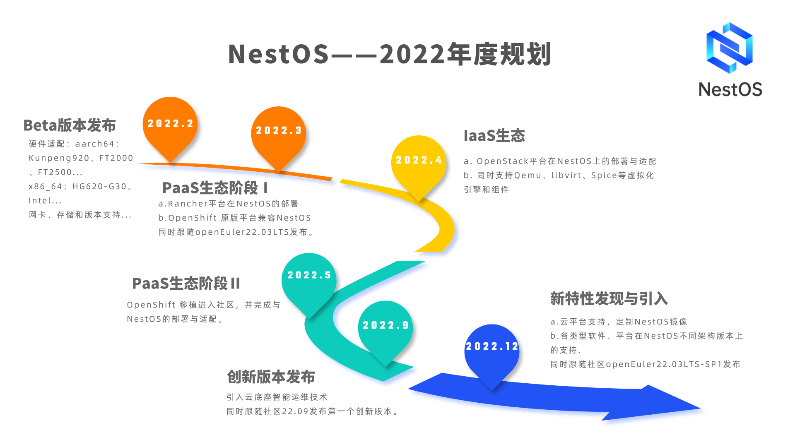

# NestOS

#### 目前NestOS-22.03-LTS-SP2已跟随NestOS-22.03-LTS-SP2版本同步发布，欢迎各位爱好者下载体验！

详情请访问[NestOS官方网站](https://nestos.openeuler.org/)。

#### 介绍
NestOS是一款在openEuler社区CloudNative sig组孵化的云底座操作系统，专注于提供最佳的容器主机，大规模下安全的运行容器化工作负载。

Nest即“巢穴”，作为可以包容podman（鼹鼠）、iSulad（蚂蚁）、docker（集装箱）的“巢穴”，NestOS即化身为可以搭载iSulad、docker、podman等基础平台的操作系统。

NestOS将配置工具ignition与rpm-ostree、OCI支持、SElinux强化等技术集成在一起，采用基于双根文件系统、容器技术和集群架构的设计思路，搭载iSulad、docker、podman等主流容器基础平台，克服了由于用户修改系统内容、用户服务对系统组件依赖，以及系统软件包升级时不稳定中间态等种种导致升级过程不可靠的因素，最终以一种轻量级、定制化的操作系统呈现出来。可以适应各种不同的基础设施环境，并与OKD紧密集成，针对运行Kubernetes进行了优化，使系统具备十分便捷的集群组建能力。

目前NestOS beta版已经在鲲鹏920、飞腾2000、飞腾2500等平台上完成了适配。 

#### 快速开始
[在虚拟化平台部署-以VMware为例](https://gitee.com/openeuler/NestOS/blob/master/docs/zh/usr_manual/%E5%BF%AB%E9%80%9F%E5%BC%80%E5%A7%8B.md)

#### NestOS应用指南
1.  [rpm-ostree使用](https://gitee.com/openeuler/NestOS/blob/master/docs/zh/usr_manual/rpm-ostree%E4%BD%BF%E7%94%A8.md)
2.  [k8s+iSulad搭建](https://gitee.com/openeuler/NestOS/blob/master/docs/zh/usr_manual/K8S+iSulad%E6%90%AD%E5%BB%BA.md)
3.  [zincati自动更新](https://gitee.com/openeuler/NestOS/blob/master/docs/zh/usr_manual/zincati%E8%87%AA%E5%8A%A8%E6%9B%B4%E6%96%B0%E4%BD%BF%E7%94%A8.md)
4.  [NestOS定制化](https://gitee.com/openeuler/NestOS/blob/master/docs/zh/usr_manual/%E5%AE%9A%E5%88%B6NestOS.md)
5.  [ignition配置示例](https://gitee.com/openeuler/NestOS/blob/master/docs/zh/usr_manual/ignition%E9%85%8D%E7%BD%AE.md) 
6.  [容器镜像更新使用](https://gitee.com/openeuler/NestOS/blob/master/docs/zh/usr_manual/%E5%AE%B9%E5%99%A8%E9%95%9C%E5%83%8F%E6%9B%B4%E6%96%B0%E4%BD%BF%E7%94%A8.md) 

#### 功能特性

1.  容器技术
2.  rpm-ostree
3.  nestos-installer
4.  Zincati
5.  Cincinnati
6.  ignition系统初始化
7.  Afterburn

详细内容请点击[功能特性详细说明](https://gitee.com/openeuler/NestOS/blob/master/docs/zh/usr_manual/%E5%8A%9F%E8%83%BD%E7%89%B9%E6%80%A7%E6%8F%8F%E8%BF%B0.md)

#### 容器性能测试

使用NestOS-22.03.20220323版本，横向对比 docker，podman，iSulad 容器引擎性能。测试结果如下:

| operator(ms) | Docker | Podman | iSulad | vs Docker | vs Podman |
| :----------: | :----: | :----: | :----: | :-------: | :-------: |
|  100*creat   |  1706  | 20748  |  1130  |   -34%    |   -95%    |
|  100*start   |  9313  |  11359  |  2636  |   -72%    |   -77%    |
|   100*stop   |  1316  |  1511  |  518   |   -61%    |   -66%    |
|    100*rm    |  1351  |  5582  |  920   |   -32%    |   -84%    |

更多详细内容请[点击](https://gitee.com/openeuler/NestOS/blob/master/docs/zh/usr_manual/%E6%80%A7%E8%83%BD%E5%AF%B9%E6%AF%94%E6%B5%8B%E8%AF%95.md)

#### NestOS roadmap

#### 主要贡献者

|   Gitee ID    |   公司   |          邮箱           |
| :-----------: | :------: | :---------------------: |
|  @duyiwei7w   | 麒麟软件 |   duyiwei@kylinos.cn    |
|  @ccdxx       | 麒麟软件 |   chendexi@kylinos.cn    |
|  @ningjinnj   | 麒麟软件 |   ningjin@kylinos.cn    |
|    @shanph    | 麒麟软件 |  lishanfeng@kylinos.cn  |
| @wangyueliang | 麒麟软件 | wangyueliang@kylinos.cn |
| @fu-shanqing  | 麒麟软件 |  fushanqing@kylinos.cn  |
| @duguhaotian  |   华为   |   liuhao27@huawei.com   |

欢迎感兴趣的小伙伴加入我们

[1]: ./images/NestOS-roadmap.png "NestOS-roadmap.png"
