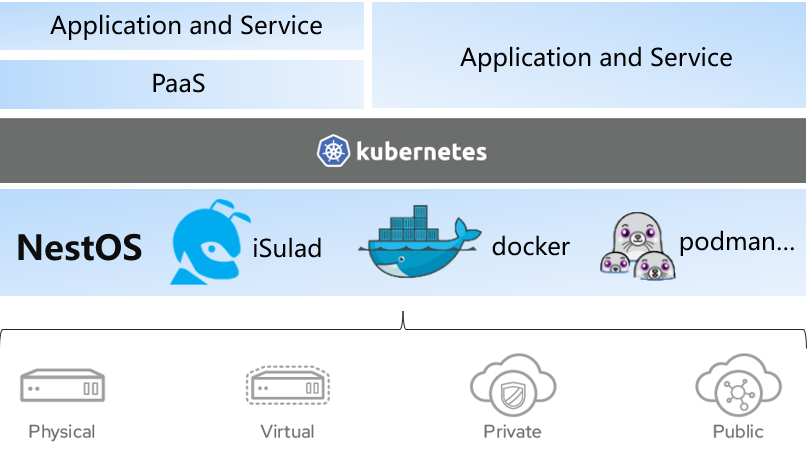

#### 在不断演进的云原生世界中，容器化和虚拟化技术已经成为了现代应用程序交付和管理的关键组成部分。为满足这个不断增长的需求，我们基于NestOS-22.03-LTS-SP2版本全新出发，推出了NestOS For Container 和 NestOS For Virt两个版本，专注于提供最佳的容器主机和虚拟化解决方案。现已发布NestOS-22.03-LTS-SP4-20240628版本，欢迎各位开发者访问[NestOS官方网站](https://nestos.openeuler.org/)下载体验。

## 1. NestOS For Container
NestOS For Container（以下简称NFC）集成了rpm-ostree支持、ignition配置等技术，采用双根文件系统，原子化更新的设计思路，使用nestos-assembler快速集成构建。并针对K8S、openStack等平台进行适配，优化容器运行底噪，使系统具备十分便捷的集群组建能力，可以更安全的运行大规模的容器化工作负载。

### 1.1 NFC-快速开始
[在虚拟化平台部署-以VMware为例](https://gitee.com/openeuler/NestOS/blob/master/docs/zh/usr_manual/%E5%BF%AB%E9%80%9F%E5%BC%80%E5%A7%8B.md)

### 1.2 NFC-应用指南
①.  [rpm-ostree使用](https://gitee.com/openeuler/NestOS/blob/master/docs/zh/usr_manual/rpm-ostree%E4%BD%BF%E7%94%A8.md)
②.  [zincati自动更新](https://gitee.com/openeuler/NestOS/blob/master/docs/zh/usr_manual/zincati%E8%87%AA%E5%8A%A8%E6%9B%B4%E6%96%B0%E4%BD%BF%E7%94%A8.md)
③.  [NestOS定制化](https://gitee.com/openeuler/NestOS/blob/master/docs/zh/usr_manual/%E5%AE%9A%E5%88%B6NestOS.md)
④.  [ignition配置示例](https://gitee.com/openeuler/NestOS/blob/master/docs/zh/usr_manual/ignition%E9%85%8D%E7%BD%AE.md) 
⑤.  [容器镜像更新使用](https://gitee.com/openeuler/NestOS/blob/master/docs/zh/usr_manual/%E5%AE%B9%E5%99%A8%E9%95%9C%E5%83%8F%E6%9B%B4%E6%96%B0%E4%BD%BF%E7%94%A8.md) 
⑥.  [更多功能特性详细说明](https://gitee.com/openeuler/NestOS/blob/master/docs/zh/usr_manual/%E5%8A%9F%E8%83%BD%E7%89%B9%E6%80%A7%E6%8F%8F%E8%BF%B0.md)

## 2. NestOS For Virt
NestOS For Virt（以下简称NFV）是一个专为虚拟化场景而设计的版本，预安装了虚拟化关键组件，其目标是用户可以轻松创建和管理虚拟机，无论是在开发、测试还是生产环境中工作，都能够提供卓越的虚拟化性能，同时可以在高性能的虚拟机上运行各种工作负载，实现资源隔离和安全性。

无论是运行云原生应用程序、虚拟化环境，还是两者兼顾，NestOS For Container 和 NestOS For Virt 都是理想之选。它们提供了稳定性、性能和安全性，以满足现代数据中心和云环境的要求。

## 3. 六大特性助力NestOS全新出发

### 3.1 云原生一体化运维工具
NestOS For Container专属容器云部署运维工具NKD（nestos-kubernetes-deployer），是基于NestOS部署kubernetes集群，与容器云业务与云底座OS一致性运维而准备的解决方案。其目标是在集群外提供对集群基础设施（包括操作系统和kubernetes基础组件）的部署、更新和配置管理等服务，从而简化了集群部署和升级的流程。

### 3.2 PilotGo插件式运维管理平台
PilotGo是麒麟软件在openEuler社区孵化的插件式运维管理平台。本次PilotGo针对NestOS平台特性及最佳应用实践，为NestOS平台带来了定制化的运维管理功能及全新的架构感知插件特性。

### 3.3 x2NestOS:不可变模式转换工具
x2nestos是一款将通用形态操作系统转换为 NestOS For Container 版本的快捷部署工具。NestOS For Virt版本默认集成，也可通用于以yum或apt主流包管理器管理的其他通用linux操作系统。该工具基于kexec动态加载内核特性，实现跳过引导阶段完成操作系统部署，有效降低现有集群转换为NestOS For Container难度和成本。

### 3.4 轻松定制系统镜像
NestOS for Containers，作为基于不可变基础设施思想的容器云底座操作系统，将文件系统作为一个整体进行分发和更新。这一方案在运维与安全方面带来了巨大的提升。然而，在实际生产环境中，官方发布的版本往往难以满足用户的需求，因此需要更方便的定制手段。现NestOS For Container集成ostree native container特性，可使容器云场景用户利用熟悉的技术栈，只需编写一个ContainerFile(Dockerfile)文件，即可轻松构建定制版镜像，用于自定义集成组件或后续的升级维护工作。

### 3.5 Rubik在离线混部
Rubik是一个自适应单机算力调优和服务质量保障的容器混部引擎，NestOS  For Container版本已预开启Rubik在离线混部相关内核特性，支持基于rubik容器混部引擎的整体解决方案，通过对资源进行合理调度与隔离，在保障关键业务服务质量的前提下极大提升容器云场景资源利用率。

### 3.6 内核特性增强
我们对nestos-kernel进行了独立维护，并基于openEuler-22.03-sp2内核版本进行开发。在这个过程中，我们专注于改进mm、cpu、cgroup等方面的内核特性，以创造出与Euler内核有所差异并具有更好优化性能的特点。

#### 更多详细内容访问[NestOS官方网站](https://nestos.openeuler.org/)

## 4. 容器性能测试

使用NestOS For Container-22.03-LTS-SP2.20230928版本，横向对比 docker，podman，iSulad 容器引擎性能。测试结果如下:
通过数据可以看出在NestOS For Container运行容器的性能远优于传统的CentOS

       
| operator(ms) | NestOS(Podman) | CentOS(Podman) | NestOS(iSulad) | CentOS(iSulad) | NestOS(Docker) | CentOS(Docker) |
| :----------: | :----: | :----: | :----: | :-------: | :-------: | :-------: |
|  100*creat   |  3436  | 6761  |  858  |   882    |   1375    |   2919    |
|  100*start   |  5496  |  10130  |  1885  |   2123    |   7397    |   18400    |
|   100*stop   |  2516  |  2532  |  457   |   497   |   1052    |   465    |
|    100*rm    |  2971  |  3141  |  501   |   566    |   1116    |   6838    |

## 5. 主要贡献者

|   Gitee ID    |   公司   |          邮箱           |
| :-----------: | :------: | :---------------------: |
|  @duyiwei7w   | 麒麟软件 |   duyiwei@kylinos.cn    |
|  @ccdxx       | 麒麟软件 |   chendexi@kylinos.cn    |
|    @shanph    | 麒麟软件 |  lishanfeng@kylinos.cn  |
| @wangyueliang | 麒麟软件 | wangyueliang@kylinos.cn |
| @jianli-97    | 麒麟软件 |  lijian2@kylinos.cn     |
| @duguhaotian  |   华为   |   liuhao27@huawei.com   |

## 6. Honor Contributor

感谢以下原贡献者对NestOS项目及openEuler社区的贡献：

|   Gitee ID    |   公司   |          邮箱           |
| :-----------: | :------: | :---------------------: |
| @fu-shanqing  | 麒麟软件 |  fushanqing@kylinos.cn  |
|  @ningjinnj   | 麒麟软件 |   ningjin@kylinos.cn    |

欢迎感兴趣的小伙伴加入我们

[1]: ./images/NestOS-roadmap.png "NestOS-roadmap.png"
